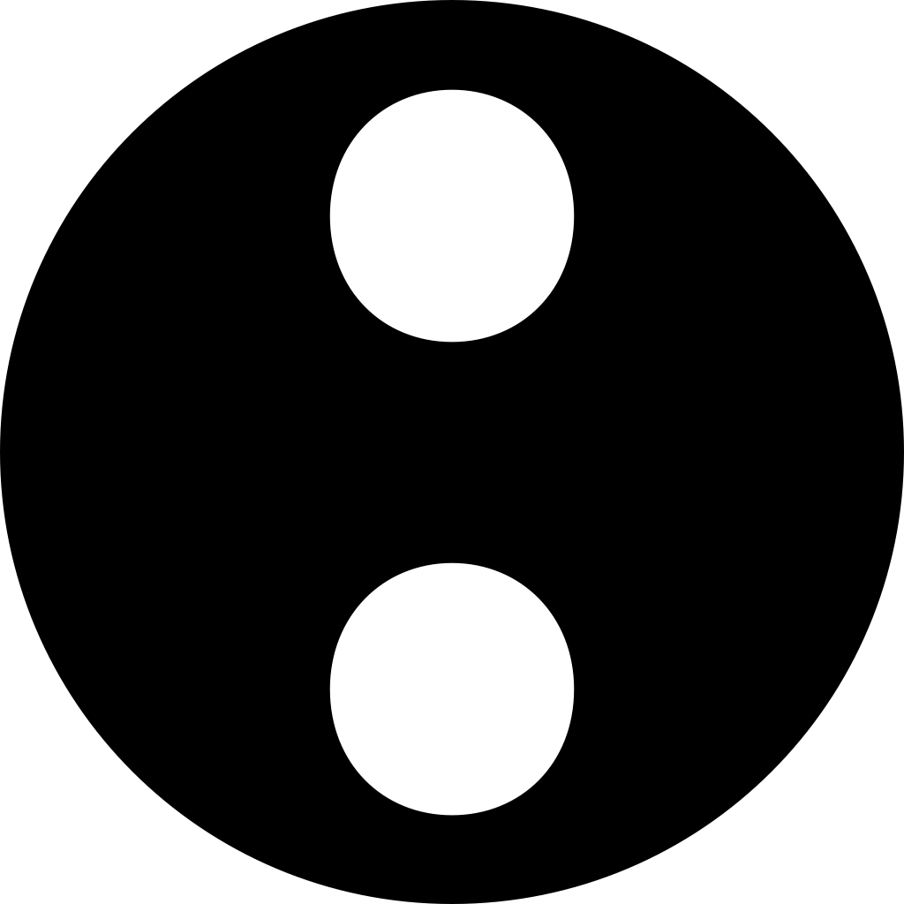

 

<h1 align="center">Hi there, I'm Xavier👋</h1>

###

<h2 align="left">💫 About Me:</h2>

###

<h3>I'm a Software Engineering student from the University of Ottawa</h3>

- 🔭 I’m currently working on Bingo, a visual concurrency debugger for Go, with xsachax and jwt
- 🌱 I’m currently learning about
- 📫 Contact me at: xavier.lermusieaux@gmail.com
- 🌐 Reach out in French or English!
- 😄 Pronouns: He/Him

###

  

 

<h2 align="left">🛠 Languages and Tools</h2>

  <table width="100%">
    <thead>
      <tr>
        <th width="16%"></th>
        <th width="28%">Languages</th>
        <th width="28%">Frameworks & Libraries</th>
        <th width="28%">Tools</th>
      </tr>
    </thead>
    <tbody>
      <tr>
        <td align="center"><b>Current</b></td>
        <td valign="top" align="left">
          
          
          
          
          
        </td>
        <td valign="top" align="left">
          
          
          
          
          
        </td>
        <td valign="top" align="left">
          
          
          
          
          
          
          
          
          
          
        </td>
      </tr>
      <tr>
        <td align="center"><b>Previously Used</b></td>
        <td valign="top" align="left">
          
          
          
          
          
          
          
        </td>
        <td valign="top" align="left">
          
          
          
          
          
          
        </td>
        <td valign="top" align="left">
          
          
          
          
          
          
          
          
          
          
          
          
          
        </td>
      </tr>
      <tr>
        <td align="center"><b>Future</b></td>
        <td valign="top" align="left">
          
        </td>
        <td valign="top" align="left">
          
        </td>
        <td valign="top" align="left"></td>
      </tr>
    </tbody>
  </table>

###
